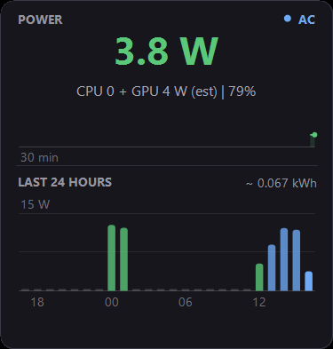

# WattAWidget


A tiny always-on-desktop widget for Windows that shows what your PC is
*actually* drawing — live watts, Screen Time-style history, kWh, and what it
costs you. Single ~1 MB exe, no installer, no services, no network access.



## Features

- **Live power draw**
  - On battery: true whole-system watts from battery telemetry, with session
    avg/peak and time remaining.
  - On AC: CPU + GPU package power from LibreHardwareMonitor sensors, plus a
    **self-calibrating base-load offset** — whenever you run on battery the
    widget compares true draw against the sensor estimate and learns your
    display/RAM/SSD baseline, so the AC number converges on a genuine
    whole-system figure. While charging it also estimates wall draw.
- **History**: 30-minute sparkline always visible; double-click cycles
  compact → 24-hour → 7-day views. Hour bars are colored by load on battery
  (green/amber/red) and blue on AC. Per-minute history persists across
  reboots (30 days, plain CSVs).
- **kWh and cost**: both history views total energy; set your per-kWh rate
  and see it in your local currency.
- **Battery health**: design vs. current full-charge capacity and cycle count.
- **Behaves like a desktop widget should**: never steals focus, hidden from
  Alt-Tab, sits above the wallpaper (including Windows Spotlight) but under
  every real window, survives Win+D, and follows you across virtual desktops.
- **Light/dark theme**, following Windows by default.

## Install

Via winget (once published):

```
winget install wattawidget
```

Or manually: grab the zip from [Releases](../../releases), extract
`WattAWidget.exe` anywhere, run it. Right-click the widget → **Start with
Windows** if you want it at logon.

## Controls

| Action | Effect |
|---|---|
| Drag | Move the widget |
| Double-click | Cycle compact → 24-hour → 7-day view |
| Right-click | View, theme, electricity rate, battery health, reset stats/calibration, autostart, exit |

## Build from source

No .NET SDK needed — it compiles with the C# compiler that ships in Windows:

```
powershell -ExecutionPolicy Bypass -File build.ps1
```

First run downloads `LibreHardwareMonitorLib` and `HidSharp` from nuget.org
(embedded into the exe as resources) and produces `bin\WattAWidget.exe`.
The icon is generated from code: `tools\make-icon.ps1`.

## How it measures

Battery mode reads `BatteryStatus` WMI telemetry — that number is the whole
machine, screen included. AC mode reads CPU package and discrete-GPU power
sensors, which miss the base load; the learned offset (see above) closes most
of that gap. Treat AC numbers as good estimates, not lab measurements.

## FAQ

**Windows SmartScreen warns when I run it.** The exe is unsigned — click
"More info → Run anyway", or build from source yourself. Code signing may come
later.

**My antivirus inspects it closely.** LibreHardwareMonitor's sensor library
contains a kernel driver used for reading CPU power registers; some AV
heuristics notice it. The library is a well-known open-source project (see
[THIRD-PARTY-NOTICES.md](THIRD-PARTY-NOTICES.md)).

**AC watts say "no power sensors found".** Sensor access sometimes requires
administrator rights — right-click → *Restart as administrator*. Battery-mode
readings never need admin.

**How do I uninstall?** Exit the widget first — right-click → Exit, or run
`wattawidget --exit` (winget can't remove a running exe). Then
`winget uninstall wattawidget` (or delete the app folder). Your data lives in
`%LOCALAPPDATA%\WattAWidget` — delete it too for a full cleanup, plus
`schtasks /Delete /TN WattAWidget /F` if you enabled autostart.

## License

MIT — see [LICENSE](LICENSE). Bundles LibreHardwareMonitorLib (MPL-2.0) and
HidSharp (Apache-2.0): [THIRD-PARTY-NOTICES.md](THIRD-PARTY-NOTICES.md).
